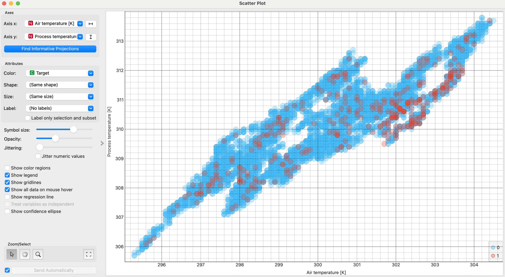
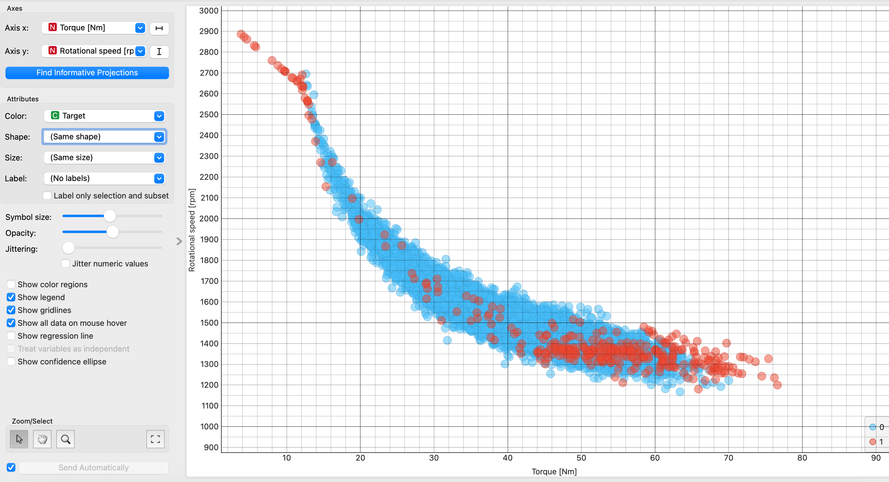
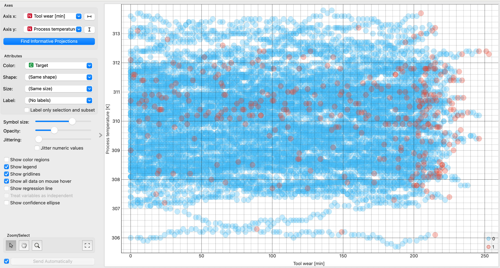
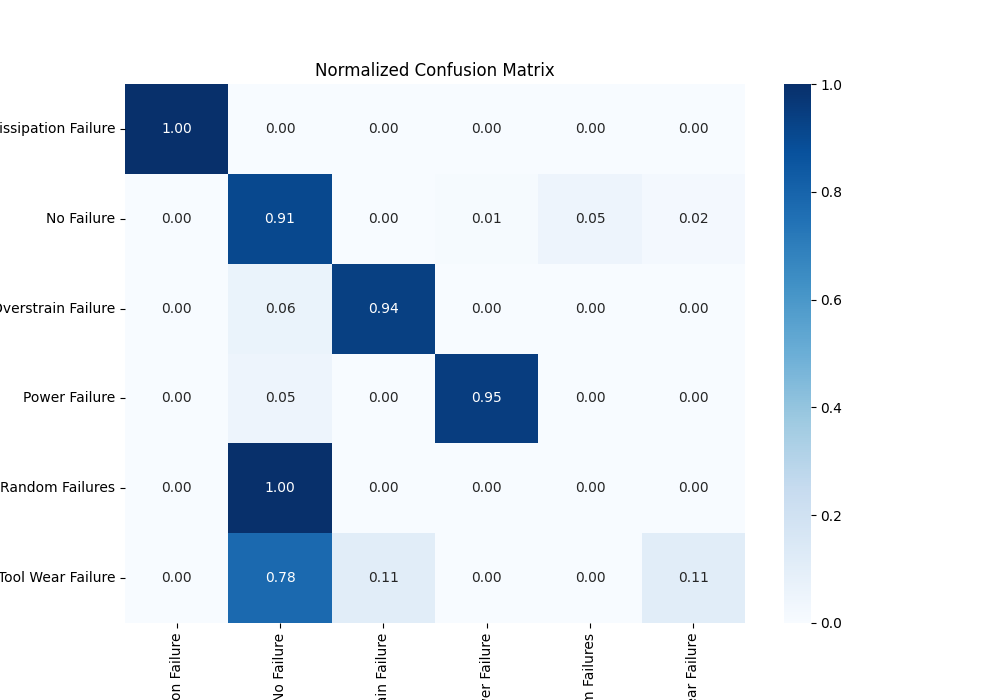
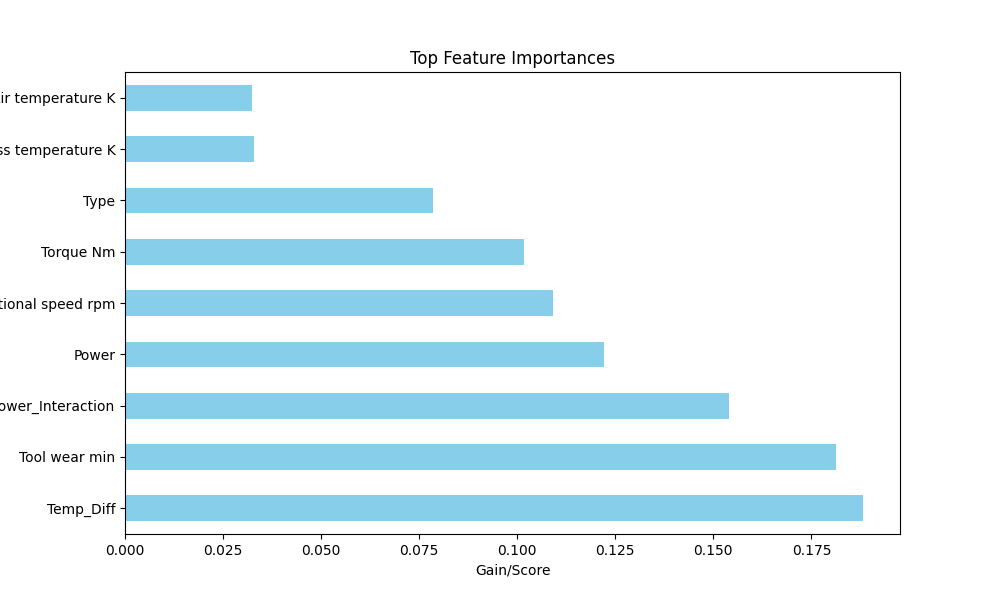

# Predictive Maintenance with XGBoost

Dieses Projekt zeigt, wie man mit Machine Learning Maschinenfehler frühzeitig erkennen kann.  
Dafür werden Prozessdaten wie Temperatur, Drehzahl, Drehmoment und Werkzeugverschleiß ausgewertet.

## Datenanalyse und Korrelation

Zur ersten Auswertung wurden mehrere Scatterplots erstellt, um Zusammenhänge zwischen den Merkmalen sichtbar zu machen.  
Die blauen Punkte stehen für normale Zustände (`Target = 0`), die roten Punkte für Fehlerfälle (`Target = 1`).

### Air temperature und Process temperature

In diesem Plot ist ein deutlicher positiver Zusammenhang zwischen Lufttemperatur und Prozesstemperatur zu erkennen.  
Je höher die Lufttemperatur ist, desto höher liegt in der Regel auch die Prozesstemperatur. Die Punkte verlaufen dabei in mehreren klaren Bändern, was darauf hindeutet, dass die Messwerte in bestimmten Bereichen oder Betriebszuständen auftreten.

Auffällig ist, dass sich fehlerhafte und normale Zustände hier nicht vollständig trennen lassen. Die roten Punkte liegen zwar oft in denselben Bereichen wie die blauen, treten aber gehäuft in bestimmten Temperaturzonen auf. Das zeigt, dass Temperatur allein nicht ausreicht, aber trotzdem ein wichtiger Einflussfaktor ist.

  

### Torque und Rotational speed

Dieser Plot ist besonders aussagekräftig.  
Zwischen Drehmoment und Drehzahl ist ein klarer negativer Zusammenhang zu erkennen: Mit steigendem Drehmoment sinkt die Rotationsgeschwindigkeit.

Auffällig ist außerdem, dass bei höheren Drehzahlen insgesamt deutlich mehr Fehlerfälle zu sehen sind. Die roten Punkte häufen sich in bestimmten Bereichen des Diagramms, was darauf hindeutet, dass Aussetzer oder Fehler nicht nur bei hoher Belastung, sondern auch in Bereichen mit hoher Drehzahl häufiger auftreten können.

Der Plot zeigt damit, dass die Kombination aus Drehmoment und Drehzahl ein wichtiger Hinweis auf den Maschinenzustand ist. 

  

### Tool wear und Process temperature

In diesem Plot ist keine klare lineare Beziehung zwischen Werkzeugverschleiß und Prozesstemperatur zu erkennen.  
Die Punkte sind breit verteilt, und die Fehlerfälle liegen größtenteils zwischen den normalen Zuständen. Das bedeutet, dass Werkzeugverschleiß allein keine eindeutige Aussage darüber zulässt, ob ein Fehler vorliegt.

Trotzdem ist der Plot interessant, weil man sieht, dass bei höherem Verschleiß etwas mehr Fehlerpunkte auftreten. Der Verschleiß ist also wahrscheinlich nicht als Einzelmerkmal stark genug, kann aber in Kombination mit anderen Merkmalen eine wichtige Rolle spielen.

  

## Training

Für die Vorhersage wurde ein XGBoost-Modell verwendet.  
Vor dem Training wurden die Daten vorbereitet, neue Features erzeugt und die Klassen mit SMOTE ausgeglichen. 
(für eine ausührliche Quellcode Dokumentation siehe documenation/xgboost_FT.ipynb)

## Confusion Matrix

Die normalisierte Confusion Matrix zeigt, wie gut das Modell die einzelnen Fehlertypen erkannt hat.  
Viele Klassen wurden sehr gut vorhergesagt. Besonders stark sind die Werte bei **Heat Dissipation Failure**, **Overstrain Failure** und **Power Failure**, da diese Klassen überwiegend richtig eingeordnet wurden.

Schwieriger war vor allem die Klasse **Tool Wear Failure**. Diese wurde häufig mit **No Failure** verwechselt. Das spricht dafür, dass sich dieser Fehlertyp in den Daten nicht so klar von normalen Zuständen abgrenzt.  
Auch **Random Failures** konnten kaum sauber erkannt werden, was daran liegt, dass zufällige Fehler oft kein klares Muster in den Merkmalen besitzen.

  

## Feature Importance

Der Bar-Plot zeigt, welche Merkmale für die Entscheidungen des Modells am wichtigsten waren.  
Besonders wichtig sind `Temp_Diff`, `Tool wear min` und `Wear_Power_Interaction`. Das zeigt, dass nicht nur die ursprünglichen Messwerte relevant sind, sondern vor allem auch die neu berechneten Merkmale.

Interessant ist dabei, dass `Temp_Diff` einen höheren Einfluss hat als die einzelnen Temperaturwerte selbst. Das bedeutet, dass die Differenz zwischen Luft- und Prozesstemperatur für die Fehlererkennung aussagekräftiger ist als ein Einzelwert.  
Auch die Kombination aus Verschleiß und Leistung ist wichtig, weil sie den Maschinenzustand besser beschreibt als nur ein einzelnes Merkmal.

  

## Fazit

Das Projekt zeigt, dass sich Maschinendaten gut mit Machine Learning analysieren lassen.  
Besonders deutlich wurde, dass einzelne Merkmale allein oft nicht ausreichen. Erst durch die Kombination mehrerer Variablen und zusätzlicher Features entstehen Muster, mit denen sich Fehler besser erkennen lassen.

Vor allem der Zusammenhang zwischen Drehmoment und Drehzahl sowie die Bedeutung der Temperaturdifferenz zeigen, dass technische Prozesse nicht nur über Einzelwerte, sondern über ihr Zusammenspiel verstanden werden müssen.  
Damit bietet das Projekt einen guten Einblick in das Thema Predictive Maintenance.
