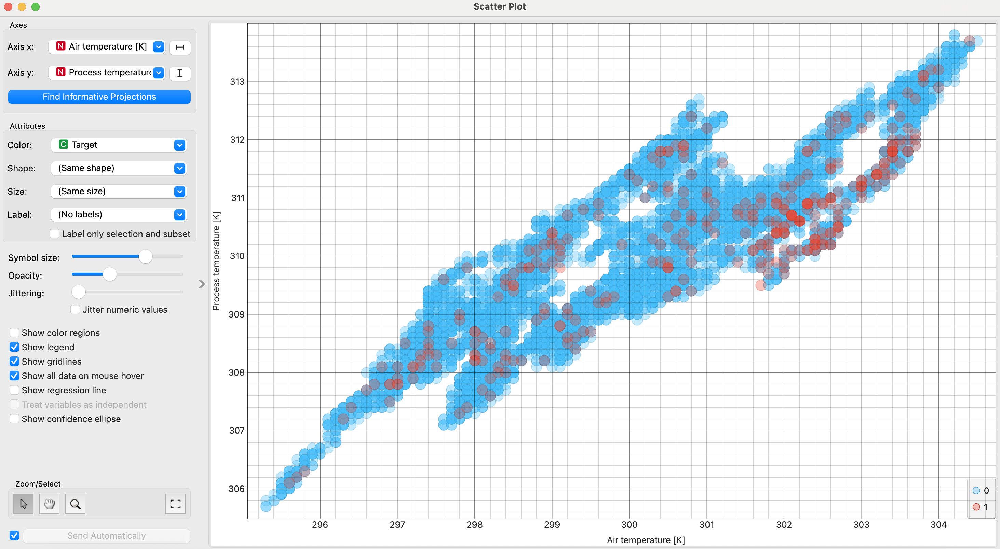
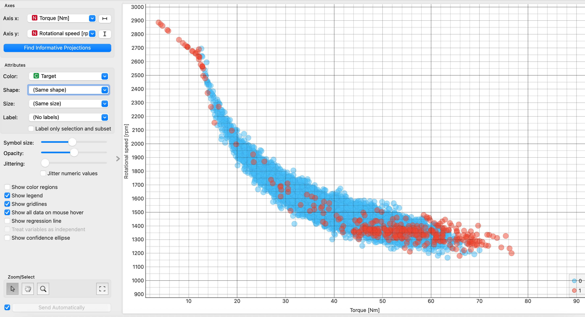
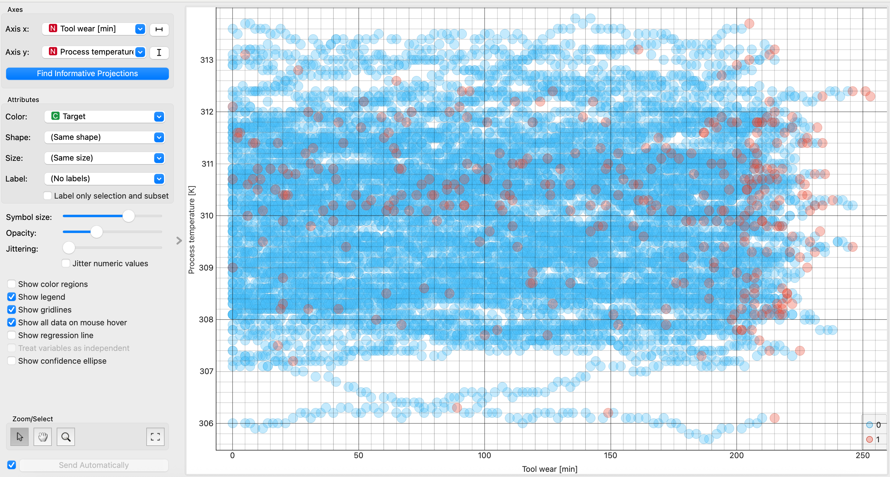
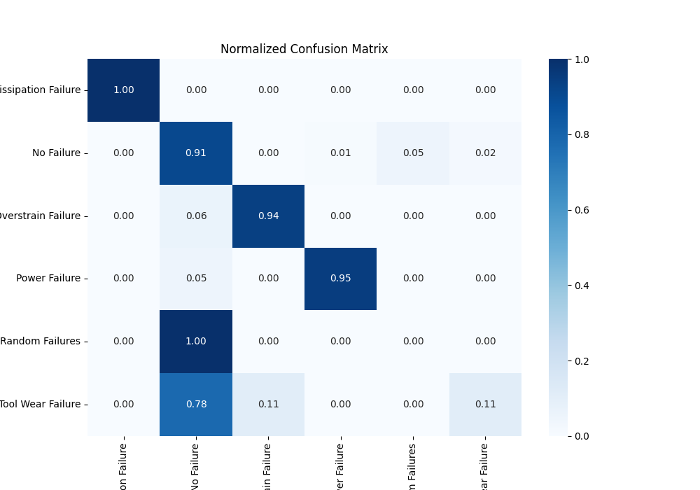
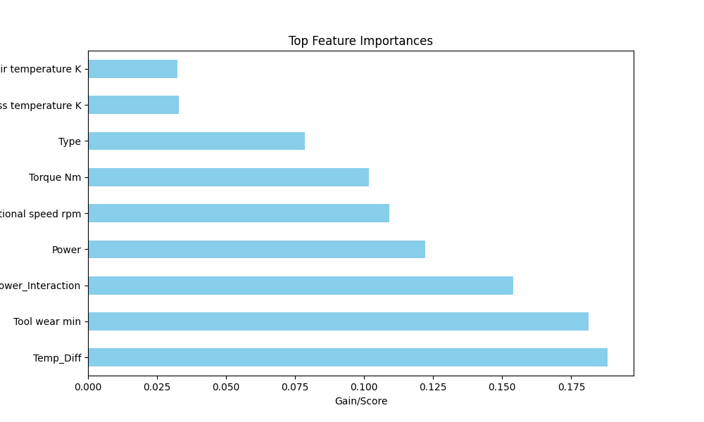

# Predictive Maintenance with XGBoost

This project demonstrates the early detection of machine failures using machine learning. The dataset used is the [Machine Predictive Maintenance Classification Dataset from Kaggle](https://www.kaggle.com/datasets/shivamb/machine-predictive-maintenance-classification).

Based on process parameters such as air and process temperature, rotational speed, torque, and tool wear, a model is trained to classify potential failures before they occur.

## Evaluation & Metrics

When analyzing predictive maintenance data, the conventional **accuracy** metric is often misleading. This dataset exhibits a significant **class imbalance**:

* **Majority class (No Failure):** 9,661 instances (~96.6%)
* **Minority class (Failure):** 339 instances (~3.4%)

A classifier that always predicts "No Failure" would achieve an accuracy of **96.6%**. Despite this high value, the model would be worthless for industrial use, as it would identify **0% of actual machine failures**. This phenomenon is also known as the "Accuracy Paradox."

To ensure the real-world usefulness of the model, the following metrics were prioritized during evaluation:

1.  **Recall:** Focus on minimizing *false negatives* (missed failures) to avoid unplanned downtime and costly consequential damage.
2.  **Precision:** Minimizing *false positives* (false alarms) to reduce unnecessary maintenance cycles and costs.
3.  **Confusion Matrix:** Detailed analysis of misclassifications, particularly the distinction between different failure types and normal operation.

By using **SMOTE** (Synthetic Minority Over-sampling Technique) during the training phase, the model's sensitivity towards the underrepresented failure class was specifically increased.

## Correlation Analysis

As a first step, a correlation analysis was performed using `correlation.py`.
This allowed the numerical features of the dataset to be initially examined at a fundamental level and initial relationships to be identified.

This analysis was important to gain a better understanding of the data and to find notable relationships between the variables.
Building on this, scatter plots were then created and the model was subsequently trained.

## Data Visualization

For further analysis, several scatter plots were created to make relationships between features visible.
Blue dots represent normal states (`Target = 0`), red dots represent failure cases (`Target = 1`).

### Air temperature and Process temperature

This plot shows a clear positive correlation between air temperature and process temperature.
The higher the air temperature, the higher the process temperature tends to be. The points form several clear bands, indicating that the measurements occur in specific ranges or operating states.

Notably, faulty and normal states cannot be fully separated here. While the red points often lie in the same areas as the blue ones, they cluster in specific temperature zones. This shows that temperature alone is not sufficient, but is still an important influencing factor.

  

### Torque and Rotational speed

This plot is particularly informative.
There is a clear negative correlation between torque and rotational speed: as torque increases, rotational speed decreases.

It is also notable that at higher rotational speeds, significantly more failure cases are visible overall. The red points cluster in specific areas of the diagram, indicating that failures can occur not only under high load, but also more frequently in areas with high rotational speed.

The plot therefore shows that the combination of torque and rotational speed is an important indicator of machine condition.

  

### Tool wear and Process temperature

This plot shows no clear linear relationship between tool wear and process temperature.
The points are widely distributed, and the failure cases largely lie between the normal states. This means that tool wear alone does not allow a clear conclusion about whether a failure is present.

Nevertheless, the plot is interesting because one can see that with higher wear, slightly more failure points occur. Wear is therefore probably not strong enough as a single feature, but can play an important role in combination with other features.

  

## Feature Engineering

To increase the predictive power of the model, new, physically motivated features were derived from the existing raw data. These help the model to better capture complex relationships between sensor values.

### Generated Features:

1.  **Temp_Diff (Temperature Difference):**
    * **Formula:** `Process temperature [K]` - `Air temperature [K]`
    * **Background:** This difference is an indicator of thermal stress and the efficiency of heat dissipation. A sudden increase in the difference can indicate overheating or a defect in the cooling system.

2.  **Power (Mechanical Power):**
    * **Formula:** `Torque [Nm]` * `Rotational speed [rpm]`
    * **Background:** Mechanical power describes the actual workload of the machine. Since failures often occur at extreme loads, this combined feature provides more precise information than examining torque and rotational speed individually.

3.  **Wear_Power_Interaction (Wear-Power Interaction):**
    * **Formula:** `Tool wear [min]` * `Power`
    * **Background:** This feature models cumulative stress. High tool wear is more critical when the machine is simultaneously operating under high load (Power). The interaction thus represents the risk of component failure under high stress and advanced wear.

By introducing these calculated features, model performance could be significantly improved, particularly in identifying specific failure types (such as *Power Failure* or *Heat Dissipation Failure*).

## Training

An XGBoost model was used for prediction.
For more detailed source code documentation, see `notebooks/xgboost_FT.ipynb`.

## Confusion Matrix

The normalized confusion matrix shows how well the model detected the individual failure types.
Many classes were predicted very well. The values are particularly strong for **Heat Dissipation Failure**, **Overstrain Failure**, and **Power Failure**, as these classes were predominantly classified correctly.

More challenging was primarily the **Tool Wear Failure** class. This was frequently confused with **No Failure**. This suggests that this failure type does not clearly distinguish itself from normal states in the data.
**Random Failures** could also barely be detected cleanly, which is due to the fact that random failures often have no clear pattern in the features.

  

## Feature Importance

The bar plot shows which features were most important for the model's decisions.
Particularly important are `Temp_Diff`, `Tool wear min`, and `Wear_Power_Interaction`. This shows that not only the original measurements are relevant, but especially the newly calculated features.

Interestingly, `Temp_Diff` has a higher influence than the individual temperature values themselves. This means that the difference between air and process temperature is more informative for failure detection than a single value.
The combination of wear and power is also important because it describes the machine condition better than a single feature alone.

  

## Conclusion

This project shows that machine data can be well analyzed with machine learning.
It became particularly clear that individual features are often not sufficient on their own. Only through the combination of multiple variables and additional features do patterns emerge that allow failures to be detected more reliably.

In particular, the relationship between torque and rotational speed, as well as the significance of temperature difference, show that technical processes must be understood not just through individual values, but through their interaction.
This project thus provides a good insight into the topic of predictive maintenance.

> [!Note]
> ChatGPT and Google Gemini were used as supporting tools in the implementation of this project.
